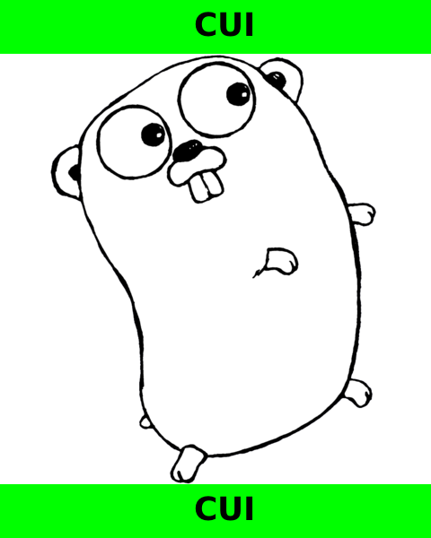

# goclassy

`goclassy` is a command-line tool that adds classification banners (e.g., **CUI, SECRET, UNCLASSIFIED**) to images. It is built in **Go** and supports **single-file processing** as well as **batch processing for directories**. The software is designed for organizations that require clear classification labels on image-based documents.

---

## **🚀 Features**
- ✅ **Classifies images** with banners at the top and bottom.
- ✅ **Supports PNG & JPEG formats**.
- ✅ **Processes individual files or entire directories**.
- ✅ **Customizable banner height** for flexible formatting.
- ✅ **Embeds a TrueType font (`DejaVuSans-Bold.ttf`)** to ensure consistent text rendering.
- ✅ **Pre-built binaries** available for **Windows** and **Linux**.

---

## 📷 Example Output
### **Classified Image (CUI)**


---

## **📦 Installation**
### **1️⃣ Download Precompiled Binaries**
Pre-built binaries for Windows and Linux are available in the `bin/` directory.

#### **📌 Windows (64-bit)**
```powershell
bin/goclassy_windows_x64.exe -f test_images/gopher1.png -c cui
```

#### **📌 Linux (64-bit)**
```bash
chmod +x bin/goclassy_linux_x64.bin
bin/goclassy_linux_x64.bin -f test_images/gopher1.png -c cui
```

### **Build From Source (Optional)**
If you prefer to compile from source, ensure you have Go installed and run:

```bash
go mod tidy
go build -o bin/goclassy main.go
```

## **🛠️ Usage**
### **📌 Command-Line Flags**
```
Usage:
  -d "directory"        Classify all images in a directory
  -f "file"             Classify a specific image file
  -c "classification"   Choose classification: unclassed, cui, or secret
  -o "output_directory" Specify output directory (default: goclassy_output)
  -h "height"           Banner height in pixels (default: 60)
```

### **📌 Example Commands**
```
# Classify a single image
bin/goclassy_linux_x64.bin -f test_images/gopher1.png -c cui -o my_output

#Classify an entire directory
bin/goclassy_linux_x64.bin -d test_images/ -c secret -o my_output
```

## **🖼️ How It Works**
Top and bottom banners are added to images based on classification.
Uses green, red, or black banners with white or black text depending on classification.
Text is automatically centered in the banners.

```
| Classification   | Banner Color | Text Color |
|------------------|--------------|------------|
| CUI              | Green        | Black      |
| SECRET           | Red          | White      |
| UNCLASSIFIED     | Black        | White      |
```
